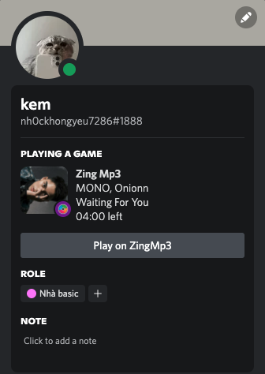
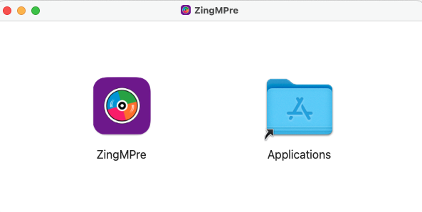

# ZingMPre

## Your Rich Presence for ZingMP3

# About

#  

**ZingMPre** is a simple show what you're playing on the **Zing Mp3** web in your Discord.

# Installation
. Install the [extension](https://addons.mozilla.org/vi/firefox/addon/zingmp3-discord-presence/).  
. Download the latest version of [ZingMPre](https://github.com/badkem/ZingMPre/releases) application.  
. Mount the dmg & move to application
#  